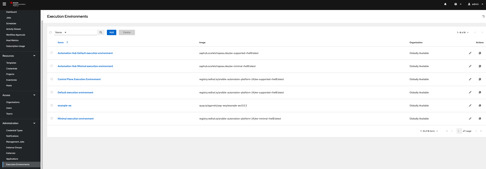
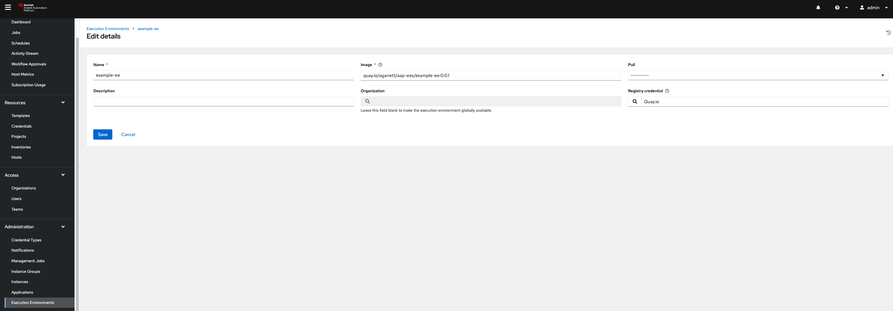

# Here is a great overview for Execution Environments
[Execution Environments Crash Course](https://docs.autodotes.com/EE%20Crash%20Course/01_overview/)

## Requirements
1) A RHEL 8 or 9 server (VM or physical) with internet access
2) The ansible-builder application. 
    * This can be installed from an rpm in the ansible-automation-platform-2.4-for-rhel9-x86_64-rpms or from pip
    * If installing from the repo you will need to enable the repo, install the rpm, and disable the repo as it should be disabled by default to avoid patching issues.
      * ```subscription-manager repos --enable ansible-automation-platform-2.4-for-rhel9-x86_64-rpms```
      * ```dnf install ansible-builder```
      * ```ansible-builder --version``` should be ```3.0.1``` (correct as of March 2024)
      * ```subscription-manager repos --disable ansible-automation-platform-2.4-for-rhel9-x86_64-rpms```
3) A container repository for hosting the built EEs
    * One of the functions of Private Automation Hub (PAH), which is part of the AAP platform, is a container registry.
      * This example uses [Red Hat Quay](https://quay.io/) which is a public container registry.
      * If you are using PAH you will need the address and login information for that server.
      * Other common container repos include GitHub Container Registry, GitLab Container Registry, JFrog Container Registry, Docker Hub, Harbor and more.
5) Your login details for Red Hats Certified Content Collections
    * Get this from [Red Hat Automation Hub on Console](https://console.redhat.com/ansible/automation-hub/token)
    * Take note of the server URL and token and define this in your ansible.cfg. See my example (./files/ansible.cfg)

## Key Points
1) Repo structure
    * each EE you want to build will be a unique directory containing a single execution-environment.yml file
2) You create the execution-environment.yml file (use my example as a guide ./execution-environment.yml)
3) Versioning your EE is done with tags.
4) The container image is built locally and then pushed into the container repo for storage & serving to AAP Automation Controller
5) The EE needs to be defined within AAP Automation Controller for use
    * EEs can be define at the inventory, project, job_template and workflow_template levels or as a default for all jobs

## How To 
These are run from inside the root of the directory you created for this EE build. The one with the execution-environment.yml file in it.
1) ```ansible-builder build -t quay.io/agarrett/aap-ees/example-ee:0.0.1```
    * The -t is critical. This tags with EE with the container repository and version. Don't use latest, assign that later.
    * If you are using a different container repo change quay.io/agarrett/aap-ees to the right info. The name of the EE here is example-ee and the version is 0.0.1
      * For example with PAH your command will look like ```ansible-builder build -t pah.corp.com/example-ee:0.0.1```
2) ```podman login quay.io```
    * This authenticates your terminal session with your repo. Podman will ask you for your username and password. If correct it will return "login succeeded". This is only needed once per terminal session.
    * For PAH your command will look like ```podman login pah.corp.com```
3) ```podman push quay.io/agarrett/aap-ees/example-ee:0.0.1```
    * This pushes the container to your container repo. If the tag does not match the container repo then the push will fail.
    * [My EE in Quay](https://quay.io/repository/agarrett/aap-ees/example-ee?tab=tags)
4) Check AAP to make sure that PAH Container Registry credential is configured. If not create it.
    * The connection between AAP and your container repo is controlled by credentials. The AAP installer should have already created a credential for PAH called "Automation Hub Container Registry" using the "Container Registry" credential type.
    * It uses the admin account username and password you defined at install. If you have changed the admin account or password in PAH directly since installing AAP you will have to update the credential in Automaiton Controller.
5) in AAP Automation Controller > Administration > Execution Environments add a definition for the new EE you have created.
    * Give it a name, define the image - quay.io/agarrett/aap-ees/example-ee:0.0.1 in this example, define the pull style (------ means missing, only pull if EE does not exist)
    * Associate the Registry Credential you created in the previous step
    * Notice you have abstraction of the EE Name with Automation Controller, and the actual EE Name stored in the registry. This allows you to update an EE without having to change all the references in Automation Controller


6) Define the EE in a job_template and run it
    * If you updated the definition of the "Default execution environment" in step 5 and the job_template does not have an EE explicitly defined then you would not have to update the job_template.

## In this Repo
  * You will find an example execution-environment.yml file
  * You will find a directory showing additional files - an ansible.cfg and an additional repo
  * You will find the build context that is created by the ansible-builder tool
